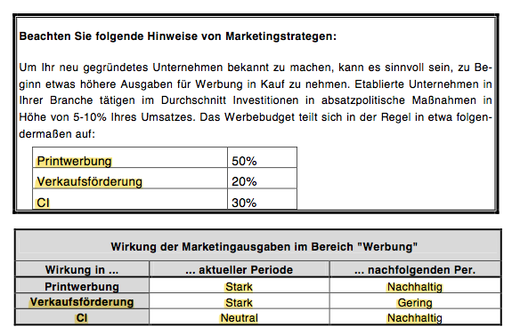

# Businessplan
### Finanzplanung
#### Beteiligungskapital
Beteiligungskapitalgeber wollen an Ihrer Unternehmung beteiligt werden. Die Quote hierfür ist Verhandlungssache.

### Planbilanz
#### Aktiva
- Anlagevermögen
- Umlaufvermögen

#### Passiva
- Eigenkapital
	- Gezeichnetes Kapital: entspricht dem Grundkapital, d.h. dem Nennwert des emittier- ten Aktienkapitals.
	- Kapitalrücklagen: entstehen durch ein Aufgeld (Agio) bei der Ausgabe junger Aktien; diese Position war bisher Teil der gesetzlichen Rücklagen.
	- Gewinnrücklagen: wurden aus dem bereits versteuerten Periodenüberschuss der Vorperioden durch Nicht-Ausschüttung der Gewinnanteile gebildet.
	- Gewinn- / Verlustvortrag: Verluste der Vorperioden vermindern nicht sofort die Rück- lagen, sondern können mit späteren Überschüssen verrechnet werden.
	- Periodenüberschuss / -fehlbetrag: Das Ergebnis der laufenden Periode wird unver- teilt in voller Höhe in die Schlussbilanz übernommen. Die Verwendung des Perio- denüberschusses (vgl. Ergänzung zur Gewinn- und Verlustrechnung), die Ausschüt- tung, Bildung von Rücklagen oder das Verrechnen mit Verlustvorträgen erfolgt buch- halterisch erst in der neuen Periode.

- Verbindlichkeiten

	- Förderdarlehen, Kredite mit einer Restlaufzeit über 5 Jahre

	- Kredite mit einer Restlaufzeit unter 1 Jahr und Überzie- hungskredite.

### Unternehmenswert
#### Berechnung des Cash Flow
Cash Flow = Ergebnis der gewöhnlichen Geschäftstätigkeit + Abschreibungen AIEG + Ab- schreibungen

Der Unternehmenswert wird als Barwert der Cash Flows berechnet.

# Gründung des Unternehmens

Jetzt sind die konstitutiven Entscheidungen zu treffen wie:

- Aufnahme von Krediten und Beantragung von Förderdarlehen
- Anmietung von Gebäuden
- Kauf von Maschinen, BGA etc.
- Einstellung von Mitarbeitern

### Preis
Für jedes Produkt kann zunächst ein Preis für den Verkauf im Fahrradgeschäft festgelegt werden (in Euro / Einheit)

# Markteintritt und Agieren am Markt

